### It’s fundamental to everything we design. The 2x grid is the geometric foundation of all the visual elements of IBM Design, from typography to columns, boxes, icons, and illustrations. It provides structure and guidance for all creative decision-making.

<AnchorLinks>

<AnchorLink>Mini unit</AnchorLink>
<AnchorLink>2x grid fundamentals</AnchorLink>
<AnchorLink>Grid behaviors</AnchorLink>
<AnchorLink>Grid influencers</AnchorLink>
<AnchorLink>Sizing scale</AnchorLink>

</AnchorLinks>

## Resources

<Row className="tile--group">
<Column offsetLg="4" colMd="4" colLg="4" noGutterSm>
  <ResourceCard
    title="IBM Grid Template"
    href="https://sketch.cloud/s/ngV7z"
    type="resource">

  </ResourceCard>
</Column>
<Column colLg="4" colMd="4"  noGutterSm>
  <ResourceCard
    title="Elements package: Grid"
    href="https://github.com/carbon-design-system/carbon/tree/master/packages/grid"
    type="resource">

  </ResourceCard>
</Column>
<Column offsetLg="4" colLg="4" colMd="4" noGutterSm>
  <ResourceCard
    title="Grid package preview"
    href="https://carbon-elements.netlify.com/grid/examples/preview/"
    type="resource">

  </ResourceCard>
</Column>
</Row>

 

 

## Mini unit

The basic unit of 2x grid geometry is the 8-pixel square _Mini unit_. Multiples of Mini Units compose the dimensions of columns, rows, boxes, along with their margins and padding. The Mini Unit adapts to your content while maintaining a consistent visual rhythm.

At breakpoint boundaries, mini units divide the screen into a fixed master grid, and multiples of mini units map to fluid grid column widths and row heights. Fixed boxes are sized in mini units, as are the fixed dimension of hybrid boxes.

Margin and padding are always applied in fixed mini unit multiples. Boxes are sized by applying a sizing scale based on either fixed mini units or fluid column widths, along with a core set of aspect ratios.

<Video vimeoId="292608020" />

## 2x grid fundamentals

The core concept of the 2x grid is to divide or multiply by two, forming a visual rhythm. Fluid grids are built by division, whereas fixed grids are built with multiplication. On breakpoint boundaries, these sizes match. Margins and padding are applied consistently in both cases.

<AnchorLinks small>

<AnchorLink>Columns and rows</AnchorLink>
<AnchorLink>Margins</AnchorLink>
<AnchorLink>Padding</AnchorLink>
<AnchorLink>Gutters</AnchorLink>
<AnchorLink>Breakpoints</AnchorLink>

</AnchorLinks>

### Columns and Rows

Columns and rows create key lines that are essential for visual rhythm, especially for typography. Construct columns by either dividing a space into a fluid grid, or by tiling fixed boxes in multiples.

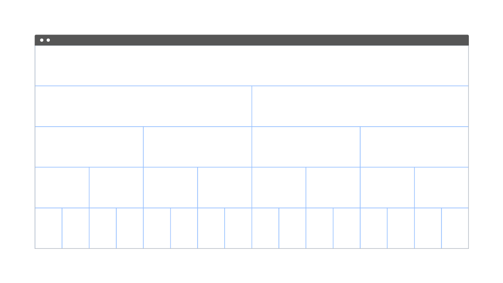

#### Fluid grid

A [fluid grid](#fluid-grid) divides space by twos. This division is immediately evident in the 2x column structure. Within a breakpoint, the column count is constant, and unit size scales with screen size. Choose a column count by starting with one, then divide by two as needed:

#### Fixed grid

A [fixed grid](#fixed-grid) starts with a fixed unit size from the sizing scale, then tiles and wraps as needed, like text. To employ the 2x concept, multiply box sizes by two and mix them together.

When tiling fixed boxes, the column count is not known in advance, but a grid emerges visually due to the use of a consistent sizing scale. On breakpoint boundaries, fixed sizing scales match column sizes.

#### Hybrid grid

[Hybrid grids](#hybrid) are also frequent in practice, and hybrid boxes have properties of both.

#### Decision tree

For dense content, use mini units for further alignment and spatial guidance.

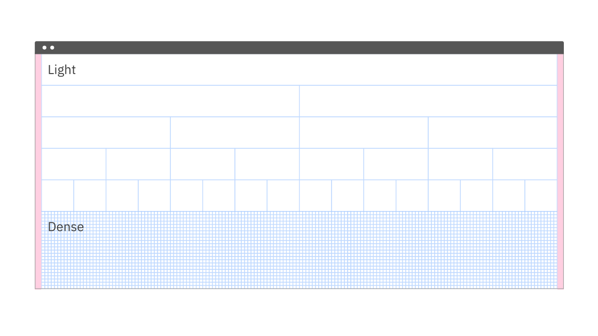

### Margins

The margins at the outer edge of the grid are always a fixed size within a breakpoint, even when columns are fluid. See [breakpoints](#breakpoints) for a table of margin sizes.

### Padding

Padding is always a fixed multiple of mini units: 16 pixels at all standard breakpoints. Always align type to the edge of box padding. Note, some design tools add padding to text boxes by default; check text box padding and remove it if necessary.

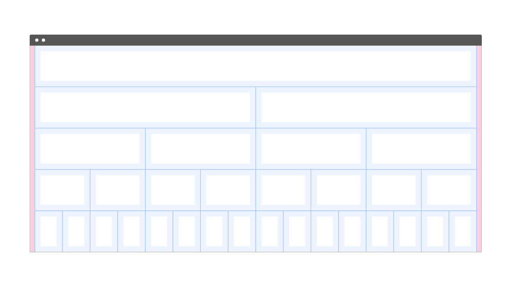

<Row>
<Column offsetLg="4" colMd="4" colLg="4">
  <DoDontExample correct label="Always place type against the padding.">

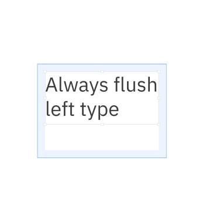

  </DoDontExample>
</Column>
<Column colMd="4" colLg="4" >
  <DoDontExample label="Never place type on the padding.">

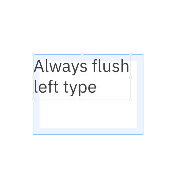

  </DoDontExample>
</Column>
</Row>

### Gutters

Grid gutters can be absent as shown above, or present as shown below. The margin around each grid box matches its padding, for a total gutter of 32 pixels. For closely related content, consider a gutterless grid. Apply gutters when content warrants more separation.

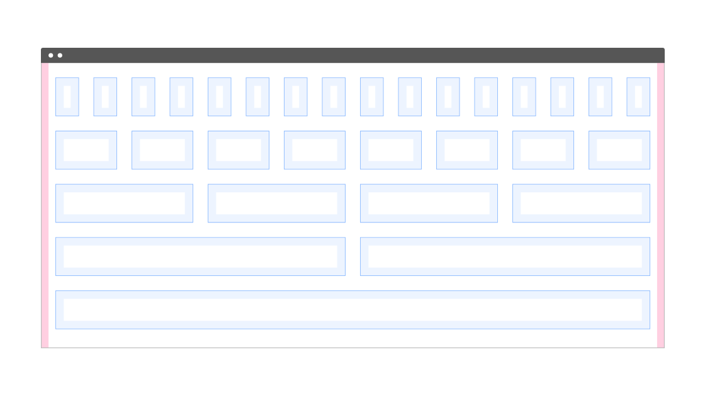

### Breakpoints

Use this set of standard breakpoints to maintain layout integrity across screen sizes. For best results, test designs and code at each of these standard breakpoints.

Create custom breakpoints to accommodate special needs, by writing your own media queries and CSS rules. Refer to the [grid code package](https://github.com/IBM/carbon-elements/tree/master/packages/grid) for more information.

| Breakpoint | Value (px/rem) | Columns | Size (%) | Size  | Padding | Margin |
| ---------- | -------------- | ------- | -------- | ----- | ------- | ------ |
| Small      | 320 / 20       | 4       | 25%      | 80 px | 16 px   | 0      |
| Medium     | 672 / 42       | 8       | 12.5%    | 80 px | 16 px   | 16 px  |
| Large      | 1056 / 66      | 16      | 6.25%    | 64 px | 16 px   | 16 px  |
| X-Large    | 1312 / 82      | 16      | 6.25%    | 80 px | 16 px   | 16 px  |
| Max        | 1584 / 99      | 16      | 6.25%    | 96 px | 16 px   | 24 px  |

For best results, test designs and code at each of these standard breakpoints.

<Video vimeoId="292015984" />

## Grid behaviors

In user interfaces, screen size is dictated by the device and the user's chosen window size. We may know content in advance, or the content may be dynamic. 

Carefully consider the user's goal for their screen space, particularly when displaying dynamic content. If a user's goal is to see more items, scale column count by tiling fixed boxes. If a user wants to see more content within each item, scale boxes and use fixed column counts.

<AnchorLinks small>

<AnchorLink>Fluid columns</AnchorLink>
- [Fixed boxes](fixed-boxes)
<AnchorLink>Hybrid boxes</AnchorLink>
<AnchorLink>Key lines</AnchorLink>

</AnchorLinks>

### Fluid grid

Fluid column structures are ideal for editorial content, dashboards, images, video, data visualizations, etc. In each case, scaling the size of things is more useful to the user than scaling the number of visible things. In a fluid grid, we divide available width in half to create columns, repeating as necessary.

At each breakpoint, column count is fixed and column width is a multiple of mini units. Row height is a multiple of column size, following recommended aspect ratios. Margin and padding are fixed multiples of mini units. In between breakpoints, actual column width is a percentage of the grid area, not a mini unit multiple. Content scales fluidly.

<Video vimeoId="292024522" />

### Fixed boxes

A grid can be formed with fixed boxes by arranging tiles in an inline block, icons in toolbars, etc. Column count grows with browser width. Tiles wrap to the next line, or are sometimes truncated with an overflow scroll.

<Video vimeoId="292024183" />

First choose a base size from the [sizing scale](#sizing-scale), then build up each box in multiples of the base size, following recommended [aspect ratios](#aspect-ratio). A grid emerges when each tile uses a multiple of a consistent base size. Following this method ensures consistency of tile sizes, even across products.

### Hybrid boxes

Hybrid boxes have different scaling rules in each dimension, so they do not use aspect ratios. When a user would resize the browser expecting content to scale in one dimension but not the other, use hybrid boxes.

Use the [sizing scale](#sizing-scale) to size a fixed dimension. Use column-width multiples to size a grid-fluid dimension. Aspect ratios do not apply.

<Video vimeoId="292025098" />

Here are some common UI behaviors:

| Examples   | Width        | Height          |
| ---------- | ------------ | --------------- |
| Header     | Fluid (Grid) | Fixed (m.u.)    |
| Toolbar    | Fluid (Grid) | Fixed (m.u.)    |
| Side Panel | Fixed        | Fluid (Grid)    |
| Menu       | Fixed        | Fluid (Content) |
| Content    | Fixed        | Fluid (Content) |
| Data Table | Fluid (Grid) | Fluid (Content) |

### Key lines

Regardless of how your grid is built, ensure the overall layout has visible key lines: vertical and horizontal lines on which multiple objects align.

Horizontal and vertical alignment are equally critical. When present, the eye can follow content more easily, increasing the perception of visual harmony.

## Grid influencers

Within a design system, layouts often follow a common structure, especially with regard to navigation. This section covers which of these UI patterns you'll need, where users will expect to see them on a page, and how they’ll affect the content that lives within the responsive grid.

<AnchorLinks small>

<AnchorLink>Screen regions</AnchorLink>
<AnchorLink>Panel behavior</AnchorLink>

</AnchorLinks>

### Screen regions

In a UI layout, users expect to find certain types of content in certain areas. We call these areas _screen regions_. It is especially important for these zones to be consistent across devices and adapt across breakpoints. [Learn more about the shell on the experimental UI shell page.](/experimental/ui-shell/usage)

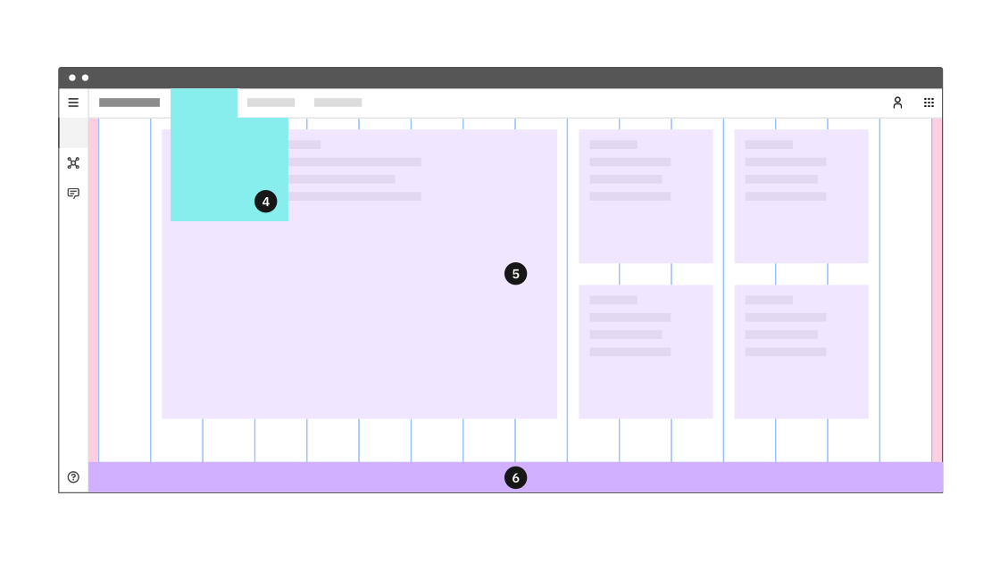

### Panel behavior

All vertical panels expand to fill the full height of the browser window.

#### Flexible panels

The flexible panels allow for both collapsed and expanded states. The expanded state of a flexible Panel is a fixed width that cannot be adjusted by the user. The collapsed Flexible Panel expands when the user hovers over any portion of it. When flexible panels expand, they either condense both the content and the grid or they push content beyond the edge of the browser.

<Video vimeoId="292975726" />

 
 

#### Fixed panels

Fixed panels maintain a static width, cannot be collapsed, and also exist outside of the responsive grid.

<Video vimeoId="292988292" />

 
 

#### Floating panels

This panel style floats above the primary content area and does not affect the responsive grid. Floating panels conceal any UI elements below them and must be dismissable by the user. Inline menus, dropdowns and tooltips also float.

<Video vimeoId="292977039" />

## Sizing scale

We provide a sizing scale for both fixed and fluid sizes. Use it to size content as well as negative space. Like a type scale, the sizing scale constrains the range of sizes to improve consistency and rhythm, while still allowing a wide range of sizes. Spacing tokens are used to apply these relationships consistently across UIs.

<AnchorLinks small>

<AnchorLink>Fixed base unit</AnchorLink>
<AnchorLink>Fluid base unit</AnchorLink>
<AnchorLink>Scaling multiple</AnchorLink>
<AnchorLink>Aspect ratio</AnchorLink>
<AnchorLink>Vertical rhythm</AnchorLink>
<AnchorLink>Components</AnchorLink>

</AnchorLinks>

### Fixed base unit

Use this fixed sizing scale, comprised of select mini unit multiples, when sizing icons, tiling boxes, and applying vertical margin space.

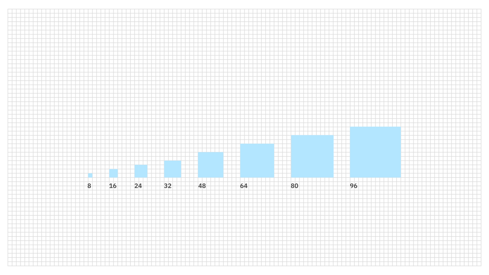

Choose a size to use as your fixed base unit. Also see the [breakpoints table](#breakpoints).

| Sizing scale (px) | Mini units |
| ----------------- | ---------- |
| 8                 | 1x         |
| 16                | 2x         |
| 24                | 3x         |
| 32                | 4x         |
| 48                | 6x         |
| 64                | 8x         |
| 80                | 10x        |

### Fluid base unit

For fluid grids, the column width is the base unit. Just as a box can span multiple columns, its height is a multiple of column width. Use cases are leading section in a webpage, divded section for editorial content, modals, etc. Check out the [breakpoints table](#breakpoints) for pixel sizings.

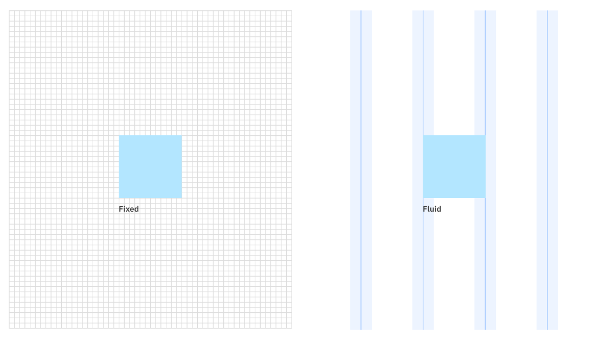

### Scaling multiple

After determining your base size, multiply it as needed for each use. For box sizing, apply an [aspect ratio](#aspect-ratio) too.

<Video vimeoId="292026497" />

### Aspect ratio

When sizing boxes, constrain dimensions to one of the aspect ratios shown below whenever possible. Doing so will heighten the perception of unity between products.

Choose an aspect ratio from the table, then multiply the base unit in each dimension as needed to set width and height, maintaining the ratio in either portrait or landscape.

| Aspect ratios                 |     |
| ----------------------------- | --- |
| 1:1, 2:1, 2:3, 3:2, 4:3, 16:9 |     |

For example, to size a fluid box with a 2:1 landscape aspect ratio, you could span 4 columns in width and 2 column-widths of height. To size a fixed box with the same aspect ratio, you could start with an 80 pixel base unit, then multiply it by 4 in width and 2 in height, for a fixed box size of 320 by 160.

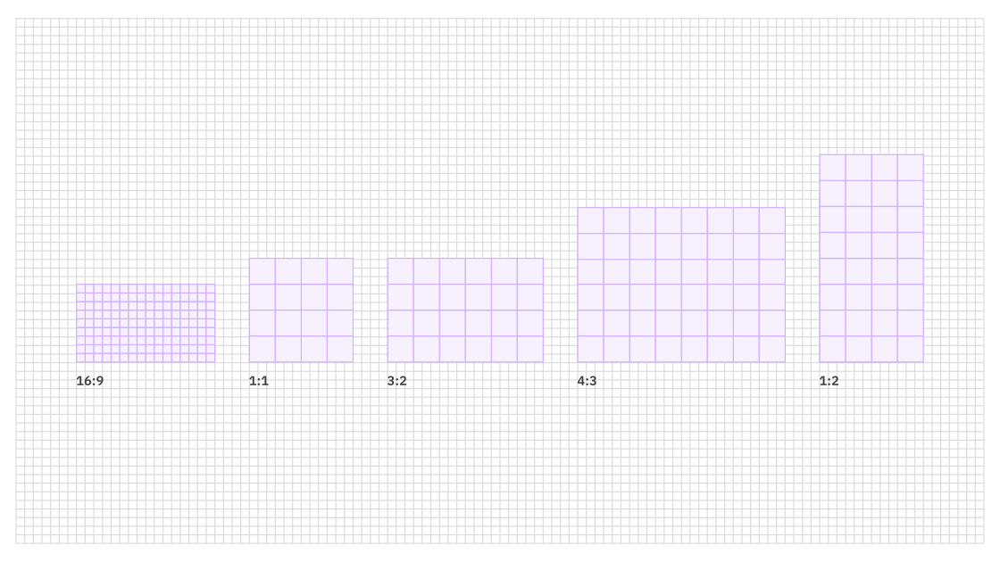

### Vertical rhythm

Use the fixed sizing scale to set vertical spacing between sections, by adding it to the top or bottom margin of a box:

<Video vimeoId="292028388" />

<Row>
<Column offsetLg="4" colMd="4" colLg="4">
  <DoDontExample
    correct
    label="Mini unit is the guide when needed. Spacer snaps to the text box and does not necessarily need to snap to the mini unit.">

  </DoDontExample>
</Column>
<Column colMd="4" colLg="4" >
  <DoDontExample label="In Sketch, always use “Auto” in alignment to ensure the text box is fitting with the content. Spacer snaps to the text box.">

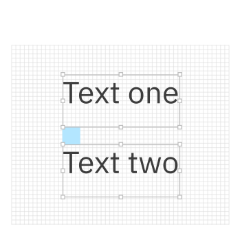

  </DoDontExample>
</Column>
</Row>

### Components

Components can be sized like other boxes: either fixed or fluid, and often hybrid, with fixed height and fluid width. When interior space within a component is cramped, use the minor sizing scale:

When multiple components adhere to the same scale, grid relationships naturally emerge. For example, vertically aligning form fields such as checkboxes and radio buttons produces a grid effect when interior spacing is consistent.

<Video vimeoId="292028752" />
