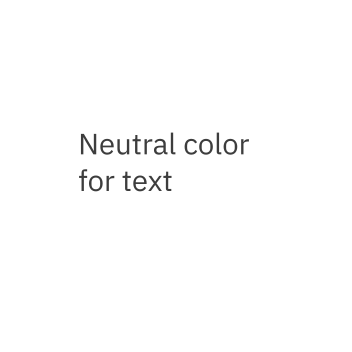
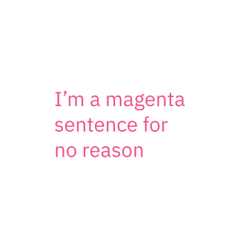
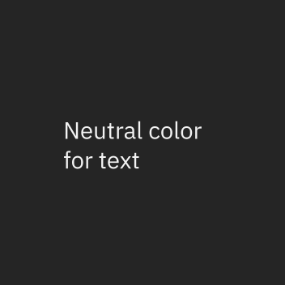
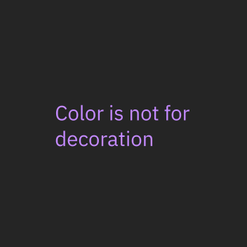
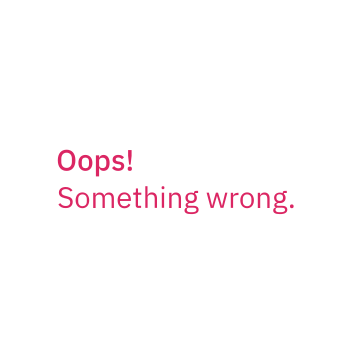
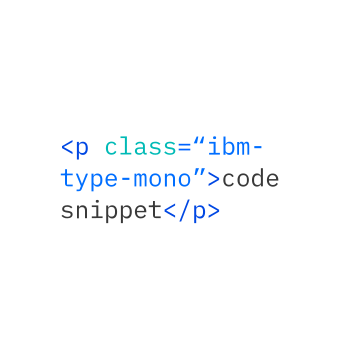

import TypeScaleTable from '../../../../src/components/TypeScaleTable';
import TypeWeight from '../../../../src/components/TypeWeight';

### Typography can help create clear hierarchies, organize information, and guide users through a product or experience.

<AnchorLinks>

<AnchorLink>Type tokens and sets</AnchorLink>
<AnchorLink>Typeface: IBM Plex</AnchorLink>
<AnchorLink>Scale</AnchorLink>
<AnchorLink>Style</AnchorLink>
<AnchorLink>Type color</AnchorLink>

</AnchorLinks>

## Resources

<Row className="tile--group">
<Column offsetLg="4" colMd="4" colLg="4" noGutterSm>
  <ResourceCard
    title="Get the latest IBM Plex™ download on GitHub"
    href="https://github.com/IBM/plex/releases/latest"
    type="resource">


  </ResourceCard>
</Column>
<Column colMd="4" colLg="4"  noGutterSm>
  <ResourceCard
    title="Visit the IBM Plex™ website to learn more"
    href="https://www.ibm.com/plex/"
    type="resource">

  </ResourceCard>
</Column>
<Column offsetLg="4" colMd="4" colLg="4" noGutterSm>
  <ResourceCard
    title="Elements package: Type"
    href="https://github.com/IBM/carbon-elements/tree/master/packages/type"
    type="resource">


  </ResourceCard>
</Column>
<Column colMd="4" colLg="4"  noGutterSm>
  <ResourceCard
    title="Type package preview"
    href="https://github.com/IBM/carbon-elements/tree/master/packages/type"
    type="resource">


 </ResourceCard> 
</Column>
</Row>

<br />

<br />

## Type tokens and sets

Carbon uses type tokens and themes to manage typography. Type tokens are pre-set configurations of typographic elements such as font size, weight, or leading (line height) that are specifically calibrated for use alongside [IBM Plex](http://ibm.com/plex) in product. Selecting the appropriate type style is determined by layout or template structure. Layouts may have several levels of architecture or areas that require varying typographic hierarchies.

### Productive vs. Expressive type sets

Productive type is reserved for use in web-based product design, where the user needs to focus on tasks. The Productive styles are curated to create a series of clear user expectations about hierarchy. Expressive type, on the other hand, allows for a more dramatic, graphic use of type in editorial and marketing design — which many users would find distracting in product.

There are two heading sets, one Productive and one Expressive. The difference between the Productive and Expressive styles is mainly evident in the Headings. Aside from the token names, which are specifically calibrated for product vs. editorial designers (e.g. $label-01 vs. $caption-01) — the Supporting and Body styles have the same values in both the Productive and Expressive sets.

## Typeface: IBM Plex

Carbon uses the open-source typeface **IBM Plex**. It has been carefully designed to meet IBM's needs as a global technology company and reflect IBM's spirit, beliefs, and design principles. IBM Plex can be accessed and downloaded from the [Plex GitHub Repo](https://github.com/ibm/plex).

<TypeWeight type="types" />

### Sans-serif font stack

```scss
font-family: 'IBM Plex Sans', 'Helvetica Neue', Arial, sans-serif;
```

### Serif font stack

```scss
font-family: 'IBM Plex Serif', 'Georgia', Times, serif;
```

### Mono font stack

```scss
font-family: 'IBM Plex Mono', 'Menlo', 'DejaVu Sans Mono',
  'Bitstream Vera Sans Mono', Courier, monospace;
```

## Scale

The IBM type scale is built on a single equation. The formula for our scale was created to provide hierarchy for all types of experiences. The formula assumes that y₀=12 px:

<TypeScaleTable />

```
Xn = Xn-1 + {INT[(n-2)/4] + 1} * 2
Xn: step n type size Xn-1: step n-1 type size
```

## Style

Typography creates purposeful texture, guiding users to read and understand the hierarchy of information. The right typographic treatment and the controlled usage of type styles helps manage the display of content, keeping it useful, simple, and effective.

### Weights

Font weight is an important typographic variable that can add emphasis and differentiate content hierarchy. Font weight and size pairings must be carefully balanced. A bold weight will always have more emphasis than a lighter weight font of the same size. However, a lighter weight font can rank hierarchically higher than a bold font if the lighter weight type size is significantly larger than the bold one.

We suggest using IBM Plex Light, Regular, and SemiBold for digital experiences. The semibold weight is ideal for section headers, but should not be used for long text.

<TypeWeight />

### Italic

Each weight has an italic style, which should only be used when you need to emphasize certain words in a sentence (titles of works, technical terms, names of devices, captions, etc.).

<TypeWeight type="italic" />

## Type color

Type color should be carefully considered, with legibility and accessibility as paramount concerns. Keep type color neutral in running text. Use primary blue for primary actions.

<Row>
<Column offsetLg="4" colMd="4" colLg="4">
<DoDontExample correct>



</DoDontExample>
</Column>
<Column colMd="4" colLg="4" >
<DoDontExample>



</DoDontExample>
</Column>
</Row>

<Row>
<Column offsetLg="4" colMd="4" colLg="4">
<DoDontExample correct dark="true">



</DoDontExample>
</Column>
<Column colMd="4" colLg="4" >
<DoDontExample dark="true">



</DoDontExample>
</Column>
</Row>

<Row>
<Column offsetLg="4" colMd="4" colLg="4">
<DoDontExample correct label="Core blue colors are used for text links and primary actions">


</DoDontExample>
</Column>
<Column colMd="4" colLg="4" >
<DoDontExample correct label="Secondary actions use Gray 100 and icons">


</DoDontExample>
</Column>
</Row>

<Row>
<Column offsetLg="4" colMd="4" colLg="4">
<DoDontExample correct label="Other use cases for colored type are code snippets, warnings, alerts, etc.">



</DoDontExample>
</Column>
<Column colMd="4" colLg="4" >
<DoDontExample correct>



</DoDontExample>
</Column>
</Row>
