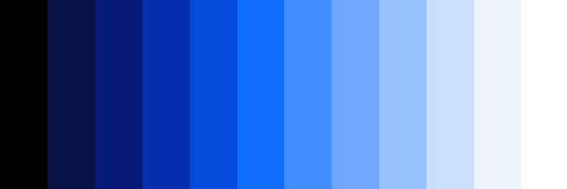
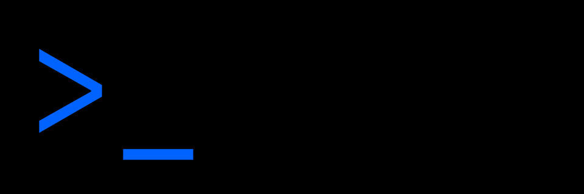
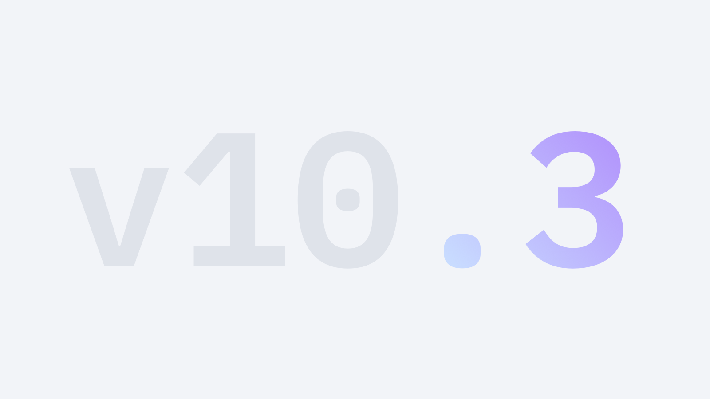

<FeatureCard
    href="/getting-started/designers"
    label="Start"
    title="Designing"
    margin="true"
    className="feature-tile--designers">

</FeatureCard>
<FeatureCard
    href="/getting-started/developers"
    label="Start"
    title="Developing"
    className="feature-tile--developers">

</FeatureCard>

### Other resources

The component libraries give developers a collection of reusable components for
building websites and user interfaces. See a
[complete list of resources.](/resources)

<Row className="tile--resource--no-margin tile--group">
<Column offsetLg="4" colLg="4" colMd="4" noGutterSm>
  <ResourceCard
    dark="true"
    title="Sketch libraries"
    href="/resources#theme-libraries"
    type="resource">

  </ResourceCard>
</Column>
<Column colLg="4" colMd="4"  noGutterSm>
  <ResourceCard
    dark="true"
    title="Carbon Components"
    href="https://github.com/carbon-design-system/carbon/tree/master/packages/components"
    type="resource">

  </ResourceCard>
</Column>
<Column offsetLg="4" colLg="4" colMd="4" noGutterSm>
  <ResourceCard
    dark="true"
    title="Carbon Components React"
    href="https://github.com/carbon-design-system/carbon/tree/master/packages/react"
    type="resource">

  </ResourceCard>
</Column>
<Column colLg="4" colMd="4"  noGutterSm>
  <ResourceCard
    dark="true"
    title="Carbon Components Angular"
    href="https://github.com/ibm/carbon-components-angular"
    type="resource">

  </ResourceCard>
</Column>
<Column offsetLg="4" colLg="4" colMd="4" noGutterSm>
  <ResourceCard
    dark="true"
    title="Carbon Components Vue"
    href="https://github.com/carbon-design-system/carbon-components-vue"
    type="resource">

  </ResourceCard>
</Column>
</Row>

### Latest articles

<Row>
<Column offsetLg="4" colLg="4" colMd="4" noGutterMdLeft>
<ResourceCard
type="article"
    dark="true"
    title="Carbon June(ish) preview"
    author="Alison Joseph"
    date="June 13, 2019"
    href="https://medium.com/carbondesign/carbon-june-ish-preview-9c5843258933"
    >

</ResourceCard>
</Column>
<Column colLg="4" colMd="4"  noGutterMdLeft>
<ResourceCard
    dark="true"
    type="article"
    title="Carbon v10.3.0 (May 2019)"
    author="Josh Black"
    date="June 6, 2019"
    href="https://medium.com/carbondesign/carbon-v10-3-0-may-2019-41b1f970f0ce"
    >

</ResourceCard>
</Column>
<Column colLg="4" colMd="4"  noGutterMdLeft>
<ResourceCard
    dark="true"
    type="article"
    title="Essentials: Learn to build with Carbon"
    author="Matt Rosno"
    date="May 15, 2019"
    href="https://medium.com/carbondesign/essentials-learn-to-build-with-carbon-1d11ce05125f"
    >

</ResourceCard>
</Column>
</Row>
