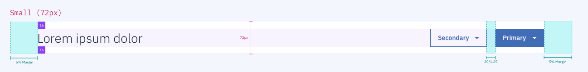
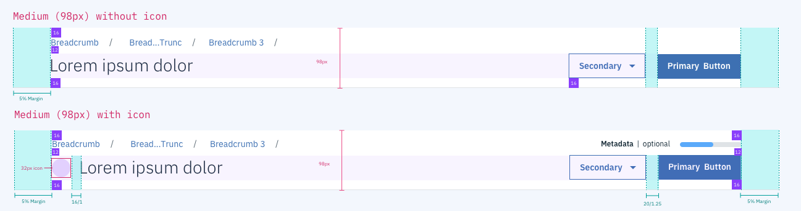
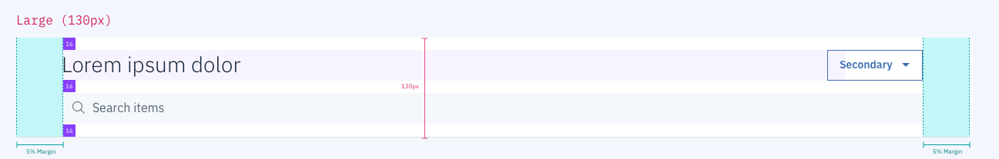

## Typography

| rem      | px      | Purpose                          |
| -------- | ------- | -------      
| 1.75rem  | Plex 28 | All page title text size         |
| 0.875rem | Plex 14 | Button, link and label text size |
| 0.75rem  | Plex 12 | Metadata text size               |

## Spacing

| Token            | rem   | px  | Role                                          |
| ---------------- | ----- | --- | --------------------------------------------- |
| **$spacing-sm**  | 0.75  | 12  | Spacing between breadcrumb and title          |
| **$spacing-md**  | 1     | 16  | All other spacing between elements            |

## Color
All page titles should use the same colors for background, border, text, buttons and status. 

| Carbon Variable              | Role                      | Value         |
| ---------------------------- | --------------------------| ------------- |
| `$ui-01`                     | Background color          | `#ffffff`     |
| `$ui-02`   						 | Border color              | `#f4f7fb`     |
| `$text-01` 						 | Title and text color      | `#152935`     |
| `$brand-01`         			 | Primary button/link color | `#3d70b2`     |
| `$support-01`     			 | Status color: error       | `#e0182d`     |
| `$support-02`     			 | Status color: success     | `#5aa700`     |
| `$support-03`     			 | Status color: warning     | `#5aa700`     |

## Structure

The width of page headers varies and responds based on the user's browser width, the existence of an internal left-navigation, or the existence of a full-height right-hand panel. 

### Page Header Small

### Page Header Medium

### Page Header Large

