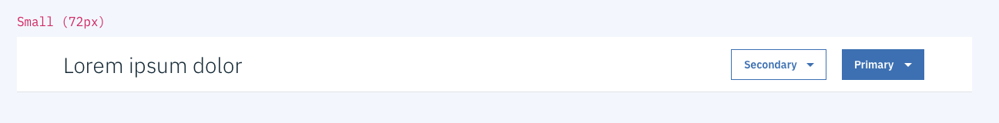
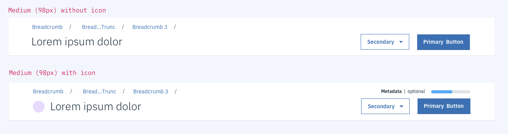
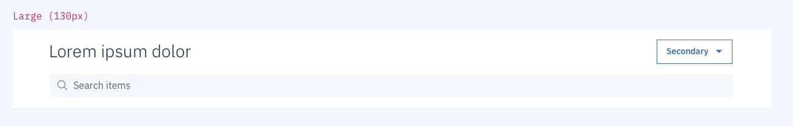
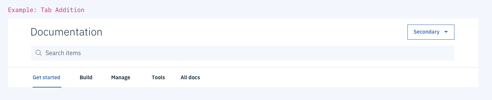
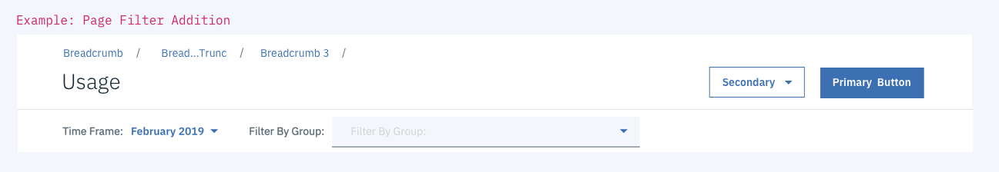

## General guidelines

All pages in IBM Cloud should have a **page header**. The purpose of a page header is to:

- Provide context for the entire page and tell the user exactly where they are in the platform;
- Act as wayfinding and/or navigation;
- Surface metadata or functionality that affects the entire experience below the header.

## Variations

Page headers work as a system with **3 height variations,** based on the number and complexity of each component the header contains.

### Small header

The small version of the page header is best used to accommodate simple page header requirements, including page title text (`.bx--type-beta`) only, or page title text `+` buttons (`.bx--btn--primary` and `.bx--btn--secondary`).

### Medium header

The medium version of the page header accounts for page title text, buttons, breadcrumbs (`.bx--breadcrumb`), and occasionally icons and metadata.

### Large header

The large version of the page header adds a Carbon full-width search (`.bx--search--lg`) component to the page title text and optional button(s).

## Additional Guidance

### Do

- Include breadcrumbs if the flow can progress two or more levels
- Include an icon if the page title refers to a specific resource name (ex: `Cloudant`, `DemoApp123`)
- Where possible, move metadata out of header and either onto the page or a "details" button (see Resource Detail Page Header Guidelines)
- Where possible, move actions out of overflow menus and into individual buttons or an "actions" inline dropdown (see Resource Detail Page Header Guidelines)

### Don't

- Use a breadcrumb if the flow doesn't progress two or more levels
- Include an icon for a platform-generated page name (ex: `Account`, `Getting Started`)
- Include metadata or actions that don't apply to the entire experience below the header
- Include tabs or filters above the page header's lower gray border

### Page header additions

Many pages require **tabs** (`bx--tab`) or**filters** above the page content. Although these elements are not included as part of the page header pattern, they may be added directly below the page header, provided the page header's lower gray border is maintained.

#### Examples

## Resources

- [Page Header Sticker Sheet](https://ibm.box.com/s/v9as4kbrw9o7uof26tca3du38al2kbtt)
- [Resource Detail Page Header Specs](https://ibm.invisionapp.com/share/AGNVIN3RJF6)

## Contributors

#### Derek Bressler

IBM Hybrid Cloud | Software Designer | dbressler@us.ibm.com

#### Account Team

Brendan Fitzpatrick, Morgan Concialdi

#### Governance Team

Adriana Morales, Kayla Lewis, Tessa Rodes | @cloud-ux-governnance
