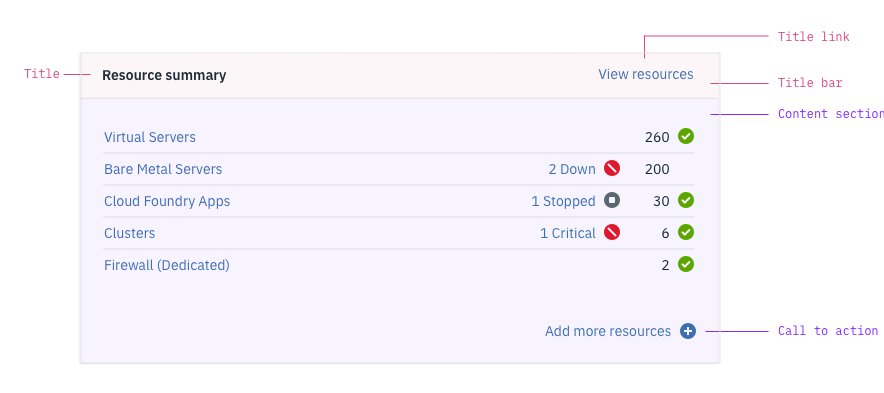
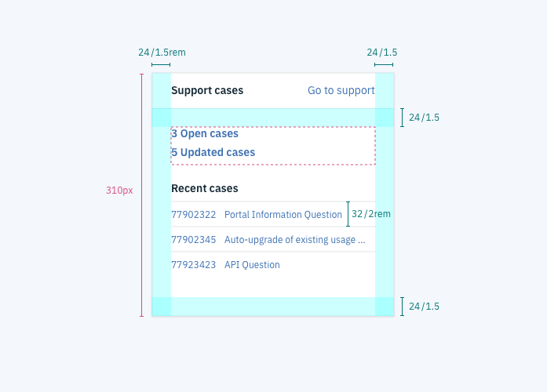
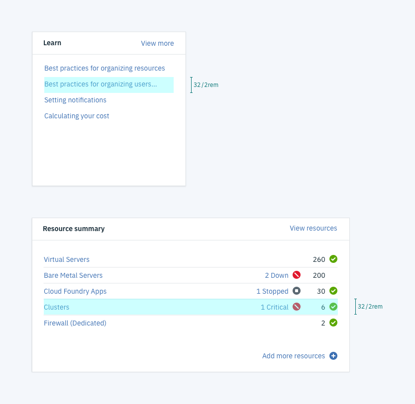
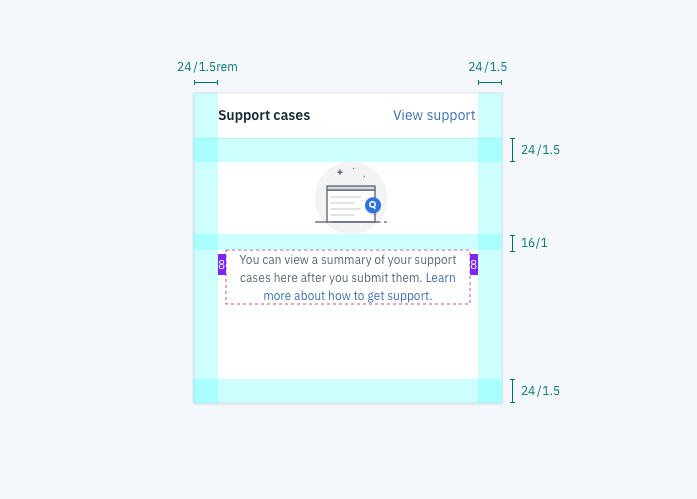
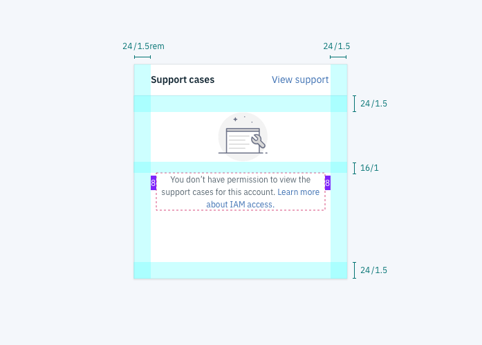
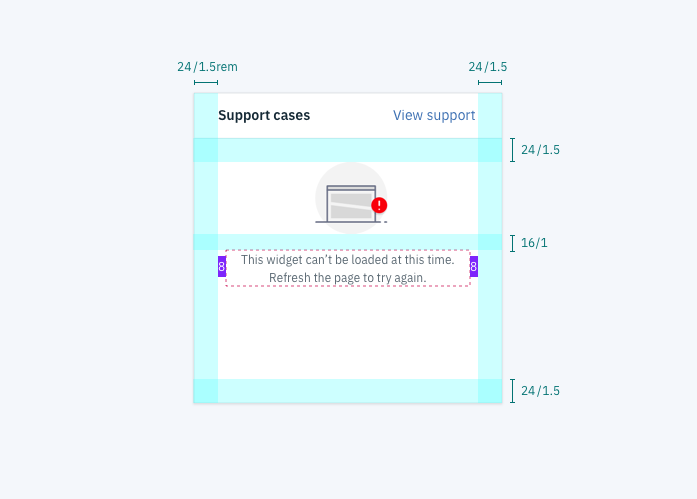
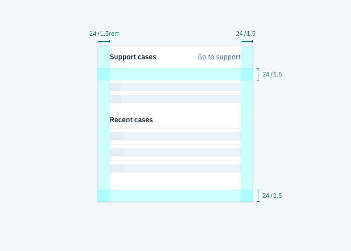
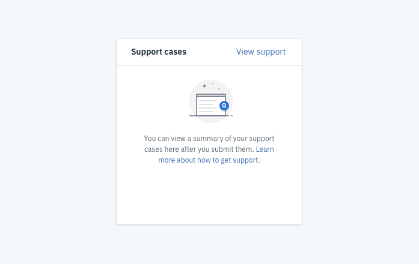
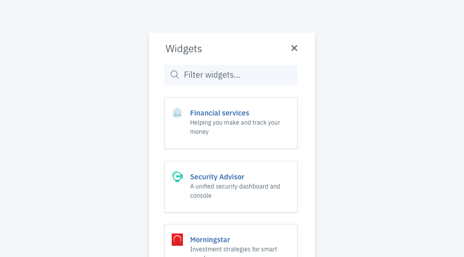

## Typography

| rem      | px      | Purpose                          |
| -------- | ------- | -------      
| 0.875rem | Plex 14 | Widget title, link, header, body text size |
| 0.75rem  | Plex 12 | Empty / no permission / error text size

## Spacing

| Token            | rem   | px  | Role                                          |
| ---------------- | ----- | --- | --------------------------------------------- |
| **$spacing-lg**  | 1.5 | 24  | List line spacing, widget padding         |
| **$spacing-md**  | 1     | 16  | All other spacing between elements            |

## Color

| Carbon variable              | Role                      | Value         |
| ---------------------------- | --------------------------| ------------- |
| `$ui-01`                     | Background color          | `#ffffff`     |
| `$text-01` 						 | Title, header, and text color      | `#152935`     |
| `$brand-01`         			 | Link color | `#3d70b2`     |
| `$text-02`     			 | Empty / no permission / error text color      | `#5A6872`     |
|      			 | Bottom border of widget title    | `#F0F3F6`     |

## Structure

### Anatomy

Each widget has a <b>title bar</b> and a <b>content section</b>. The title bar is standard for all widgets, but the content section varies depending on the widget type. 

#### Title
Identifies the widget. Max characters: 23 (includes spaces)

#### Title link
Links users to a more complete view of information summarized in the widget. The title link should be as specific as possible (i.e. "view resources" not "view all"). Max characters: 15

#### Call to action 
Provides the user with a quick action. This element is optional and can incorporate a "plus" icon if appropriate. Max characters: 23

### Padding

The widget padding should be 1.5rem (24px) for the top, left, right, and bottom of the content area. All widgets should have the same padding, regardless of size. 

### Lists

You can style lists with or without rulers separating the rows. In both cases, spacing between the rows should be 32 pixels.

## States 

Widgets have five distinct states, each with their own styling: <b>normal, empty, permission, error,</b> and <b>loading</b>. 

- In the normal state, text is left-aligned except for calls to action
- In every other state, content is center-aligned with an illustration and small, grey text

### Normal state

The normal state is the primary state. It occurs when a widget has been populated with data that the user has permission to see. 

### Empty state

The empty state occurs when the user has no data to populate the widget. 

### Permission state

This state occurs when a user does not have permission to see the widget data. For example a user may not have permission to manage other users or view usage data.

### Error state

The error state occurs when data fails to load.

### Loading state

The loading state appears while the widget data loads. Static headers are displayed as text and loading content is replaced by skeletons.

## Content

### Tone
Leverage the [Carbon Design System](https://www.carbondesignsystem.com) for guidance on capitalization, tone, voice, and terminology. In addition to the content guidance in Carbon, use the embedded assistance checklist.

### Illustrations

All dashboard illustrations should be 72x72px and should match the illustration style of these [sample dashboard illustrations](https://ibm.box.com/s/f2efq7ylbuwlfwnpwdqzk45c6mkz17bc). 

### Icons

Leverage the [Carbon Design System icon library](https://www.carbondesignsystem.com/guidelines/iconography/library) for icons within the widget iteslf. 

## Widget tiles

Each widget has a tile that can be seen when users open the "Add widget" side panel during dashboard customization. Each tile features the <b>widget icon</b>, <b>widget title</b>, and <b>short description</b> (max characters: 35).

## Resources

- [Widget Sticker Sheet](https://ibm.box.com/s/02zbfphixjgjjz4wivr59t522rnyfy2d)
- [Sample Dashboard Illustrations](https://ibm.box.com/s/f2efq7ylbuwlfwnpwdqzk45c6mkz17bc)
- [Service Framework](https://cloud.ibm.com/docs/service-framework?topic=service-framework-user-experience-ux-#ux015-dashboard-widgets)
- [Developer Guidelines](https://cloud.ibm.com/docs/developing/get-coding/console-sdk?topic=onboarding-step1-build#step1-build)

