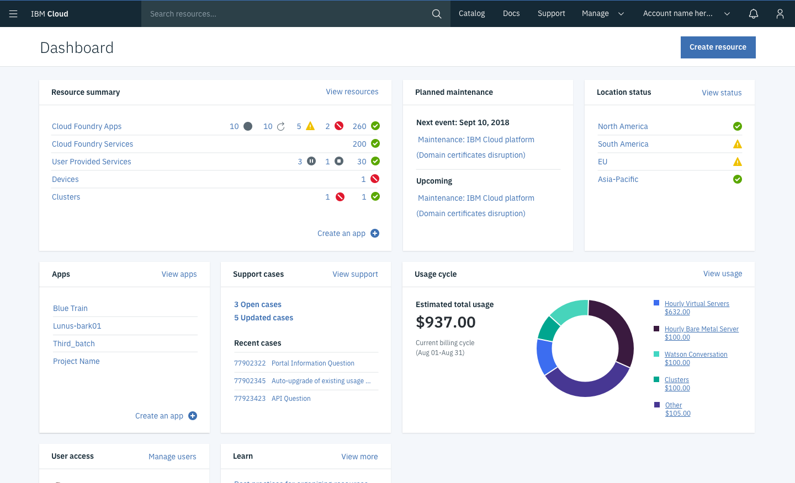
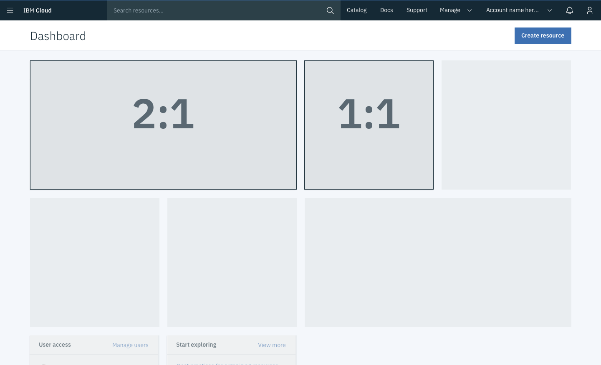

## General guidelines

A <b>dashboard widget</b> provides a summary of a platform functionality, status, or individual service. The goal of a widget is to provide actionable information that helps the user quickly accomplish a key task or track key metrics. 

 

## Variations

### Widget size

Dashboard widgets have <b>two possible sizes</b>, small and large. The height for both sizes is fixed (310px) and neither widget is currently resizable. 

- Small (1:1) - Recommended 
- Large (2:1) - Requires an additional 1:1 design for smaller viewports

 

### Widget type

There are two types of dashboard widgets, <b>core widgets</b> and <b>service widgets</b>. 

#### Core widget

Core widgets are designed by the dashboard team, and are displayed on the dashboard by default. They usually display platform functionality, such as maintenance events or support cases. 

#### Service widget

Service widgets are designed by service teams, and must be actively added to the dashboard using the customize dashboard feature. Services wishing to propose a widget should follow the widget review process (see Widget approval). 

## Contributors

#### Governance team

Adriana Morales, Kayla Lewis, Tessa Rodes, Kaley Coffield @cloud-ux-governance

#### Dashboard team

Arn Hyndman, Nancy Ching, Kala Nenkova, Holman Sze, Jeff Ng, Virginia Nicholson, Denise Heebner

#### Content team

Courtney Bittner

